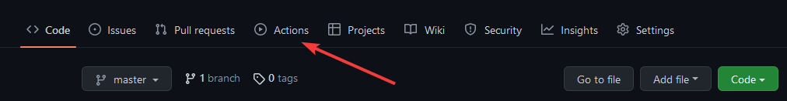
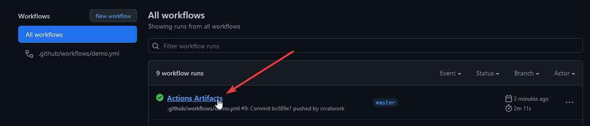
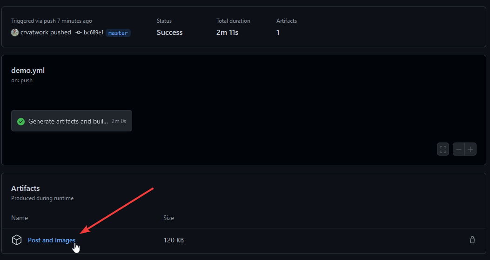

# Documentation Output Example

If you are logged in to a GitHub account you can see the generated documentation output for this example.

1. First go to the "Actions" link in this repository.

2. Then click on one of the workflow runs.

3. Finally click on the "Post and Images" link under artifacts to download a zip file.

