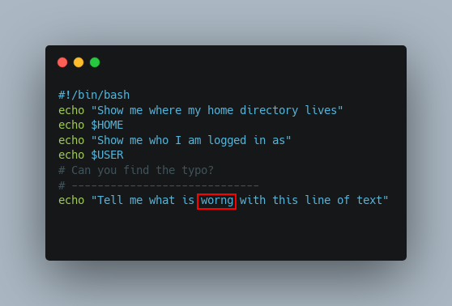

# New Perspectives on Automation

## Explore nontraditional automation applications with docs as code for tasks that are worth repeating.

Colin Vallance

## Welcome to the (Virtual) Team

If you’ve read any of my previous blogs posts you might have realized that I was primarily focused on Wi-Fi technologies, with the occasional emphasis on application programming interfaces (APIs) and automation. I’ve since moved over to leading a new virtual team here at CDW focusing entirely on automation and programmability in the product development R&D team.

From the beginning, CDW’s professional services have incorporated automation, scripts and custom software, but these practices were not necessarily distributed evenly. Our new programmability virtual team is focused on spreading awareness, building skills and applying automation within our professional services, across multiple practices and divisions.

Additionally, as CDW has grown significantly over the last few years, we’re also benefitting from knowledge brought in from our coworkers who came from IGNW, Sirius Computer Solutions, Amplified IT, and more, now all CDW companies. In the spirit of my new focus, I’m going to explore automation in an area that many do not regularly consider: documentation.

## Automate the boring stuff

I’m not going to dive in to the book ["Automate the Boring Stuff with Python",](https://automatetheboringstuff.com/) but I tend to agree with the title. I believe the tasks most worth automating are the ones that I do not want to repeat over and over via manual effort.

An example in the world of networking could be automating the retrieval of a configuration or the information from a route table. However, process automation does not necessarily need to be rooted in deep technological concepts. It can be applied to other frequently performed business operations such as documentation and content creation. Enter the concept of documentation as code.

## Consider the Docs as Code Philosophy

According to the [Write The Docs](https://www.writethedocs.org) community, documentation as code refers to the philosophy that you should be writing documentation with the same tools as code, such as issue trackers, version control, plain text markup and so on. Sharing concepts, tools and standards between developers and writers helps make documentation become more of a part of the creation process and less of an afterthought.

Working with technical writers has shown me that often there are organizational documentation standards that I am less familiar with, and the result is that I unintentionally create more review and correction work for the technical writer. By coming closer together, especially with automation tooling, the cognitive load for both parties can decrease, and we can focus on faster and higher quality documentation output.

Additionally, one huge benefit is the ability to apply change tracking through version control. For those used to version control systems (VCS) such as GitHub and GibLab, this can feel much more transparent. For newcomers, picking up basic VCS concepts is generally approachable.
Documentation as code is also a concept that has been used for years in development communities, and it is continuing to gain traction from technical writers. For example, many well-known projects, such as [Certbot](https://eff-certbot.readthedocs.io/en/stable/#), [Chef](https://docs.chef.io/), and [phpMyAdmin](https://docs.phpmyadmin.net/en/latest/), use [Sphinx](https://www.sphinx-doc.org/en/master/) to run automatic documentation generation. Large tech companies such as [Spotify](https://backstage.io/blog/2020/09/08/announcing-tech-docs) and [CloudFlare](https://blog.cloudflare.com/our-docs-as-code-approach/) have also been adopting this approach over the last few years.

I particularly enjoyed this presentation from a team at [AWS](https://www.youtube.com/watch?v=Cxuo3udElcE), given at the 2022 Write The Docs Portland conference, which highlights their continued docs as code evolution.

## Real World Application for Automation

Adopting automation is often harder to perform culturally than it is technically, so I won’t claim to have revolutionized the internal documentation process at CDW (yet). I can say that, in my role, I end up writing a decent amount of internal documentation, training labs and customer facing documentation. During a recent adjustment to an already existing training lab, I took the opportunity to add some tooling and artifacts that would make subsequent revisions easier.
By way of necessity, many lab training documents have screenshots added to them to provide proper context for the trainee. While this is very useful, it necessitates redoing each screenshot any time contextual changes need to happen.

In instances where the screenshot is only command line output or example code for a script, tools such as [carbon](http://carbon.now.sh) or [silicon](https://github.com/Aloxaf/silicon) can help create an image akin to a screenshot, based on plain text that can be easily adjusted. Regeneration of these images can be done quickly and with such consistency that it would be very difficult to accomplish the same task manually.

I also wrote a small snippet of python code that generated highlight boxes on an image by passing in pixel coordinates. The example below was generated from a fictional block of [code](https://carbon.now.sh/?bg=rgba%28171%2C+184%2C+195%2C+1%29&t=seti&wt=none&l=application%2Fx-sh&width=680&ds=true&dsyoff=20px&dsblur=68px&wc=true&wa=true&pv=56px&ph=56px&ln=false&fl=1&fm=Hack&fs=14px&lh=133%25&si=false&es=2x&wm=false&code=%2523%21%252Fbin%252Fbash%250Aecho%2520%2522Show%2520me%2520where%2520my%2520home%2520directory%2520lives%2522%250Aecho%2520%2524HOME%250Aecho%2520%2522Show%2520me%2520who%2520I%2520am%2520logged%2520in%2520as%2522%250Aecho%2520%2524USER%250A%2523%2520Can%2520you%2520find%2520the%2520typo%253F%250A%2523%2520-----------------------------%250Aecho%2520%2522Tell%2520me%2520what%2520is%2520worng%2520with%2520this%2520line%2520of%2520text%2522) and has a box with the top left corner at the x,y coordinated `243,239` and the bottom right at `291,258`.

With these informational artifacts stored alongside the main document, anyone can identically reproduce this same image or make simple adjustments as revisions are needed. This approach saves time in the maintenance of contextually rich documentation, and it reduces efforts that previously may have kept updates from happening in a timely manner.

Another example that is more a traditional docs as code is merely writing a document in a plain text markup language and then using CI/CD to generate and publish in a different format.

Recently, I’ve been working on updating a document that contains style guide and coding standards. The majority of the audience for this document will be developers. Yet, we also have a desire to publish this information in places other than our VCS and in other formats such as PDF, which might be more accessible to non-developers.

To accomplish this task, the document is written in something like [markdown](https://en.wikipedia.org/wiki/Markdown) or [asciidoc](https://asciidoc.org/), and then checked in to GitHub. We’re then using GitHub actions with a tool called [pandoc](https://pandoc.org/), which is able to convert the markdown to PDF (and many other formats) and then distribute to the appropriate audiences. To serve as an example for this scenario, I’ve written this blog post in markdown and published it on [GitHub](https://github.com/crvatwork/shiny-system) for the reader to explore.

## Think outside the docs

The examples I’ve listed are only two scenarios where I have been applying automation and reproducibility outside of pure code. There are many more ways that documentation automation could benefit your workflows and organization, but it doesn’t have to stop with documentation.

Process automation can be applied other places as well, so I encourage you to consider where you’re performing repetitive tasks, how that time could be better utilized elsewhere, and what first steps toward making tasks less manual could include.
